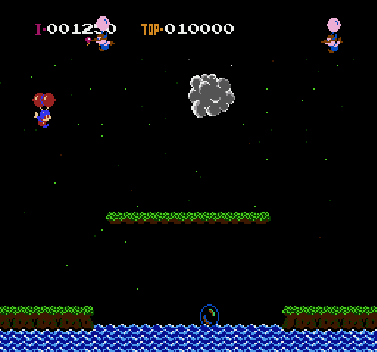
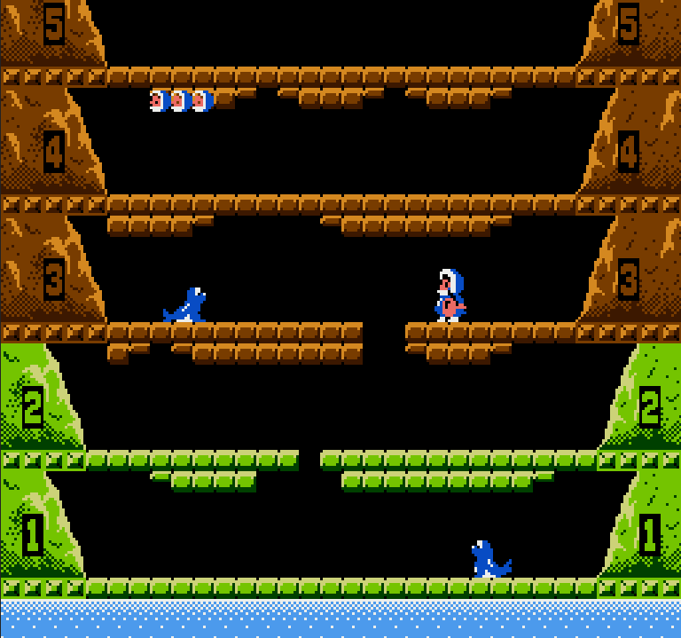
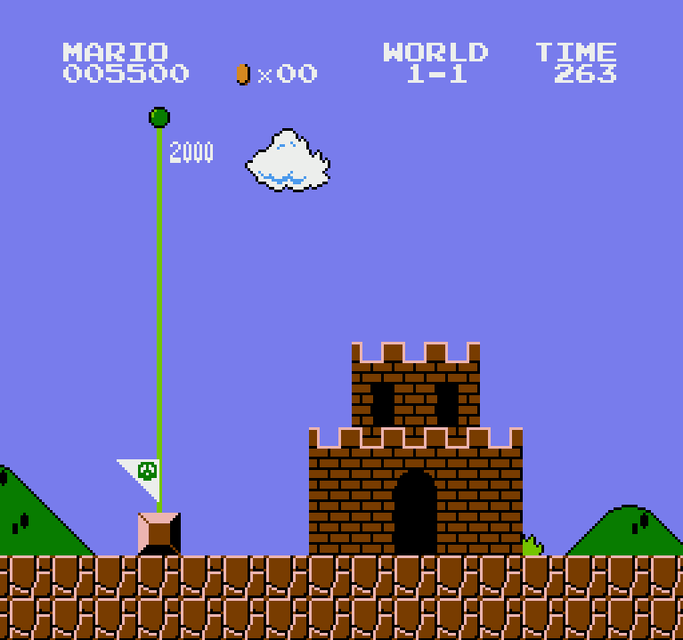

# NES-emu

**NES-emu** is an educational, portable, and MCU-friendly NES emulator written in C.  
The main goal of this project is to provide a lightweight core that can be easily ported to microcontrollers and other resource-constrained platforms.

## Showcase

  
   
  

## Features

- **Pure C implementation**: High portability and easy integration.
- **MCU-friendly**: Designed to run on microcontrollers.
- **Educational**: Clean codebase for learning NES architecture.
- **Desktop support**: Includes an SDL3-based output example for PC debugging.

## Building

To run the emulator on a desktop PC, you need a graphics output backend such as SDL.  
A sample SDL3 implementation is provided in `framebuffero.c`.

### Prerequisites

- C compiler (GCC/Clang)
- CMake
- SDL3

### Steps

1. Make sure **SDL3** is installed and linked in your `CMakeLists.txt`.

2. Create a build folder:

    mkdir build
    cd build

3. Generate build files and compile:

    cmake ..
    cmake --build .

## Running

To test a game, specify the path to your NES ROM in `main.c`:

    boot("../rom/smb.nes");

Then run the compiled binary with argument `0`:

    my_app.exe 0

## Known limitations

- **No mappers**: only Mapper 0 (NROM) games are currently supported.
- **PPU accuracy**: the renderer is scanline-based and still has known issues with Sprite 0 hit generation.
- **APU/audio**: no sound support.

## Porting to MCU

If you are porting this project to a microcontroller, consider the following:

### 1. CLI debugging

The core includes a CLI for the processor. It can read/write memory and registers via UART.  
Your MCU must support `printf` / `scanf` or a similar serial interface to use this feature.

### 2. Timing optimization

For slower hardware, you can simplify the NES cycle logic:

    cpu_tick();
    ppu_tick();
    ppu_tick();
    ppu_tick();

### 3. Display output

Rewrite `framebuffero.c` to support your specific hardware, for example:

- SPI display
- Parallel LCD
- ILI9341
- custom framebuffer output

### 4. Display output

Rewrite `controller.c` to support your type of input, like USB/SPI/GPIO

### 5. Performance

If emulation is too slow, try to:

- inline critical function calls,
- reduce call overhead in hot paths,
- enable compiler optimizations such as `-O3`.

## Notes

This project is mainly intended for educational purposes and technical experimentation.

If you find it useful, feel free to leave a ⭐